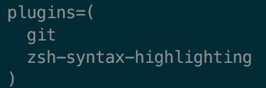
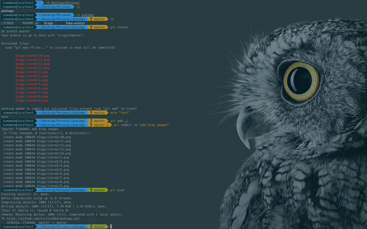

# iTerm2 安装

## 下载 iTerm2

> brew cask install iTerm2

## 安装Oh my zsh

```bash
# curl 安装方式
sh -c "$(curl -fsSL https://raw.githubusercontent.com/robbyrussell/oh-my-zsh/master/tools/install.sh)"

# wget 安装方式
sh -c "$(wget https://raw.githubusercontent.com/robbyrussell/oh-my-zsh/master/tools/install.sh -O -)"
```


## 安装PowerLine

``` python3
pip install powerline-status --user
```

## 安装PowerFonts

安装字体库需要首先将项目git clone至本地，然后执行源码中的install.sh。

在你习惯的位置新建一个文件夹，如：~/Desktop/OpenSource/

```dash
# git clone
git clone https://github.com/powerline/fonts.git --depth=1
# cd to folder
cd fonts
# run install shell
./install.sh
```


安装好字体库之后，我们来设置iTerm2的字体，具体的操作是iTerm2 -> Preferences -> Profiles -> Text，在Font区域选中Change Font，然后找到Meslo LG字体。有L、M、S可选，看个人喜好：


## 安装配色方案

配色方案在使用VIM或Colorful Log时会变得非常有用，同时界面也不会一片黑绿一样死板。

同样使用git clone的方式下载源码进行安装：

```dash
cd ~/Desktop/OpenSource
git clone https://github.com/altercation/solarized
cd solarized/iterm2-colors-solarized/
open .
```

在打开的finder窗口中，双击Solarized Dark.itermcolors和Solarized Light.itermcolors即可安装明暗两种配色：


再次进入iTerm2 -> Preferences -> Profiles -> Colors -> Color Presets中根据个人喜好选择这两种配色中的一种即可：


## 安装主题

下载agnoster主题，执行脚本安装：

```dash
cd ~/Desktop/OpenSource
git clone https://github.com/fcamblor/oh-my-zsh-agnoster-fcamblor.git
cd oh-my-zsh-agnoster-fcamblor/
./install
```

执行上面的命令会将主题拷贝到oh my zsh的themes中：


拷贝完成后，执行命令打开zshrc配置文件，将ZSH_THEME后面的字段改为agnoster。

```dash
vi ~/.zshrc
```


修改完成后按一下esc调出vi命令，输入:wq保存并退出vi模式。

此时command+Q或source配置文件后，iTerm2变了模样：


## 安装高亮插件

这是oh my zsh的一个插件，安装方式与theme大同小异：

```dash
cd ~/.oh-my-zsh/custom/plugins/
git clone https://github.com/zsh-users/zsh-syntax-highlighting.git
vi ~/.zshrc
```

这时我们再次打开zshrc文件进行编辑。找到plugins，此时plugins中应该已经有了git，我们需要把高亮插件也加上：


请务必保证插件顺序，zsh-syntax-highlighting必须在最后一个。

然后在文件的最后一行添加：source ~/.oh-my-zsh/custom/plugins/zsh-syntax-highlighting/zsh-syntax-highlighting.zsh

按一下esc调出vi命令，输入:wq保存并退出vi模式。

执行命令使刚才的修改生效：

```dash
source ~/.zshrc
```

至此大功告成，请看最终效果图：


## 可选择、命令补全

跟代码高亮的安装方式一样，这也是一个zsh的插件，叫做zsh-autosuggestion，用于命令建议和补全。

```dash
cd ~/.oh-my-zsh/custom/plugins/
git clone https://github.com/zsh-users/zsh-autosuggestions
vi ~/.zshrc
```

找到plugins，加上这个插件即可：


转自:
> https://github.com/sirius1024/iterm2-with-oh-my-zsh